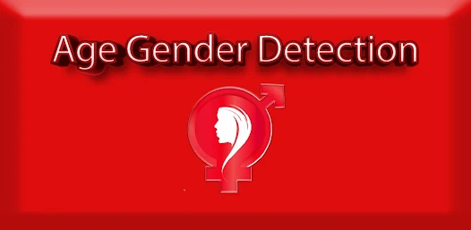
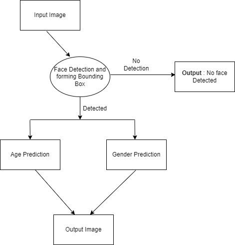

[](https://opensource.org/licenses/MIT)

### Meet the Lead Developer: Yuvraj Singh Chowdhary

**Yuvraj Singh Chowdhary** is the visionary behind this project, bringing a wealth of expertise in computer vision, deep learning, and image processing. With a passion for innovation, Yuvraj has spearheaded groundbreaking advancements in age and gender detection using OpenCV and state-of-the-art neural networks.

Connect with Yuvraj on [LinkedIn](https://www.linkedin.com/in/yuvraj-singh-chowdhary/) to learn more about his contributions to the field of computer vision.


# Age and Gender Detection using Deep Learning



This repository contains a Python script for detecting age and gender from images using pre-trained deep learning models. It utilizes OpenCV for face detection and inference, providing accurate predictions of age groups and gender labels.

## Technical Details

The script employs the following components:

- **Face Detection**: Uses a pre-trained deep learning model to detect faces in images.
  
- **Gender Classification**: Utilizes another pre-trained model to classify the gender (male or female) of each detected face.
  
- **Age Estimation**: Utilizes a separate pre-trained model to estimate the age group of each detected face.

## Models Used

- **Face Detection Model**: 
  - Prototxt: `opencv_face_detector.pbtxt`
  - Model: `opencv_face_detector_uint8.pb`
  
- **Gender Classification Model**: 
  - Prototxt: `gender_deploy.prototxt`
  - Model: `gender_net.caffemodel`
  
- **Age Estimation Model**: 
  - Prototxt: `age_deploy.prototxt`
  - Model: `age_net.caffemodel`

## How to Use

### Setup

1. **Clone the Repository**:
   ```bash
   git clone https://github.com/yourusername/Age-and-Gender-Detection.git
   cd Age-and-Gender-Detection
   ```

2. **Install Dependencies**:
   ```bash
   pip install opencv-python-headless
   ```

3. **Download Pre-trained Models**:
   - Download the necessary model files listed above and place them in the project directory.

### Run the Script

To detect age and gender from an image:

```bash
python age_gender_detection.py --image path_to_input_image.jpg
```

Replace `path_to_input_image.jpg` with the path to the image file you want to analyze.

### Sample Inputs and Outputs

- **Sample Inputs**: Contains images used for testing the model.
  
- **Sample Outputs**: Contains images showing the model's predictions.

## Additional Information

### Project Flowchart




